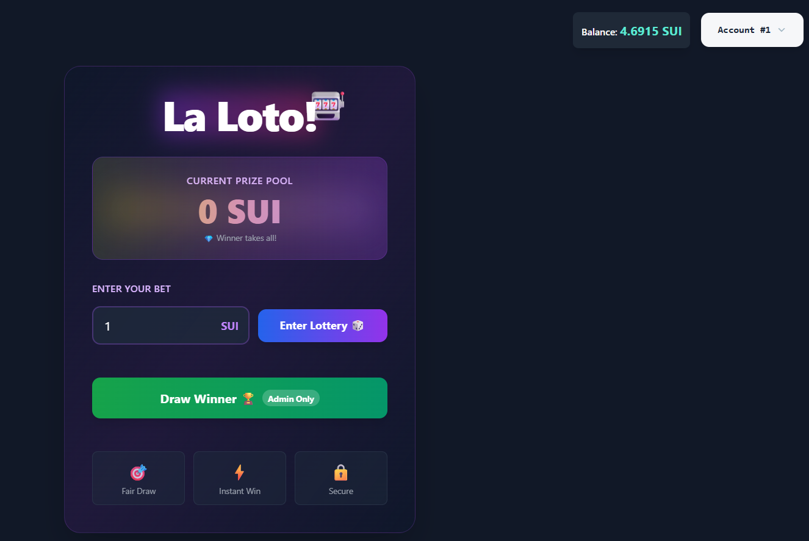

Decentralize lottery
Main idea:
This project allow people to bet in a lottery-like application without a centerelize entity.
It have been built upon the Sui blockchain network and React.
The main file is the smart contract in: laLoto/sources/final_contract.move.
Players can enter the lottery, The system will give them a ticket, The value of the ticket determines by the amount the player pay, the more he pays, the more numbers he get, the more likely the player ticket has to include the winning number and win.
Today, Admin when he starts the current lottery commit a hash(random_number+salt), and when he close the lottery he sends it again so the smart contract verify that the secret_number he choose was truly from the beginning, but this system is still not good and require trust for the admin, because he can choose WHEN to close the lottery, and because he knows the secret_number, he knows based on the number of tickets registered who is going to win before he close it.
How it works today:

Admin starts and end lottery with commands like:

start round:

sui client call --package (package.id) --module no_rake_lotto --function start_round --args (admin_cap) (lottery.id) “commit_vector" (clock) --gas-budget 100000000

draw_winner_and_start_next_round:

sui client call --package (package.id) --module no_rake_lotto --function draw_winner_and_start_next_round --args (admin_cap) (lottery.id) (secret_number) “(salt_vector) "(new_commit_vector)" (clock) --gas-budget 100000000

Users can buy tickets and claim rewards, If lottery cancel (any user can cancel if admin didn’t close lottery for enough time) users can refund their ticket.

Steps in the future:
1)	Add cancel current lottery button
2)	Better random, Implement a random mechanism potentially on chain with pyth in order to determine the winner without anyone be able to manipulate the outcome
3)	Improve frontend
4)	Upload frontend to walrus

#using tickets instead of saving how much each player played inside the smart contract makes the project more scalable, Player entering the lottery only involves adding the money to the prize pool and getting a ticket compared to read the data structures of all the players that already pay and write it again.

#Walrus allow to store the frontend and expand him in the future efficiently.

#If I ever choose to upload to mainnet, I can use .eth domain pointing to my walrus frontend, Every .eth domain is an ERC-721 NFT on Ethereum meaning it is very difficult to censor them.
In addition, opera and brave browsers have ENS supports built in.

#Lottery cannot be closed in one of two conditions:
1.	Less than a minute have passed before the last Lottery have been finished.
2.	Not enough money to pay the fee to the one who calls this function.
